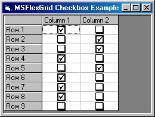



## Add Checkbox to MSFlexGrid Control

### Description

This example shows how to add a Checkbox to the MSFlexGrid control.
 
### More Info
 

             |
---                |---
**Submitted On**   |2003-02-10 17:22:06
**By**             |[Chris Pietschmann](https://github.com/Planet-Source-Code/PSCIndex/blob/master/ByAuthor/chris-pietschmann.md)
**Level**          |Intermediate
**User Rating**    |4.8 (119 globes from 25 users)
**Compatibility**  |VB 6\.0
**Category**       |[Miscellaneous](https://github.com/Planet-Source-Code/PSCIndex/blob/master/ByCategory/miscellaneous__1-1.md)
**World**          |[Visual Basic](https://github.com/Planet-Source-Code/PSCIndex/blob/master/ByWorld/visual-basic.md)
**Archive File**   |[Add\_Checkb1542602102003\.zip](https://github.com/Planet-Source-Code/chris-pietschmann-add-checkbox-to-msflexgrid-control__1-43129/archive/master.zip)

